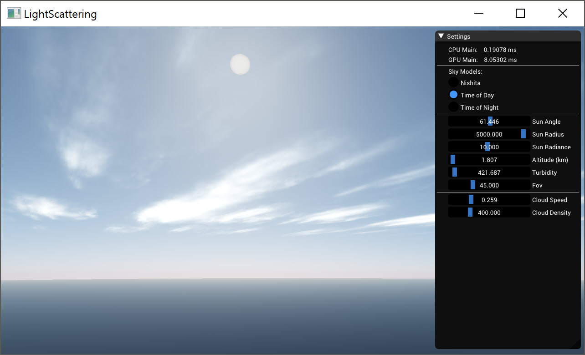
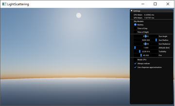
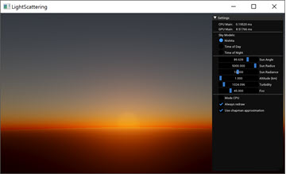
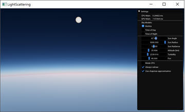
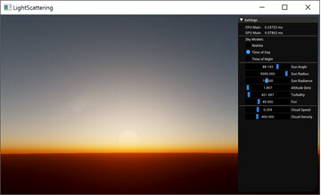
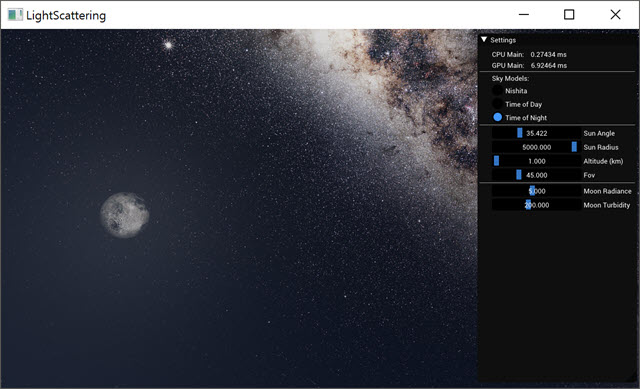

Rendering atmospheric scattering

[method]

1. Nishita: based on Nishita's algorithm and ported to GPU
2. Time of day: use code ray-mmd skybox
3. Time of night: use code ray-mmd skybox

[Nishita]

[Ray-MMD]

[reference]

1. [Nishita93] Nishita, 1993, "Display of the Earth Taking into account Atmospheric Scattering"
2. [ScratchPixel] Simulating the Colors of the Sky, https://www.scratchapixel.com/lessons/procedural-generation-virtual-worlds/simulating-sky
3. [Shuler12] Shuler, 2012, "An Approximation to the Chapman GrazingIncidence Function for Atmospheric Scattering"
4. [Hillaire16] Sebastien Hillaire, 2016, Physically Based Sky, Atmosphere and Cloud Rendering in Frostbite
5. [Gustav14] Gustav Bodare, 2014, Efficient and Dynamic Atmospheric Scattering 
6. [Preethama99] S Preetham, ‎1999, A Practical Analytic Model for Daylight

[sources]

1. [Ray-MMD] https://github.com/ray-cast/ray-mmd/
2. [Sky-Particles-Shader] https://github.com/Tw1ddle/Sky-Particles-Shader

[Note]
 
1. Nishita method examples: https://bensimonds.com/2014/10/02/atmospheric-rendering-with-osl/ 
2. Ray parameter examples: https://github.com/gaj-cg/ray-mmd-docs-ja/wiki/7_1_スカイボックス
3. Playground: https://hexadrive.jp/hexablog-mae/wp-content/uploads/2016/06/20160616_sample.html 