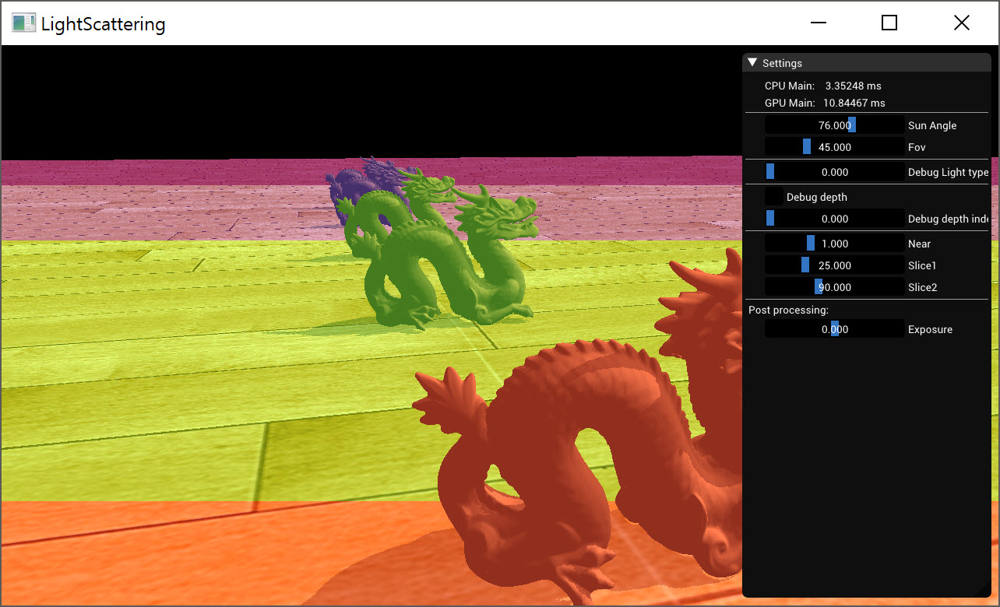

Basic Cascade shadow mapping

> Without optimize and without artifact remove

Base on tutorial 'ogldev' lesson 49.

Using GLM and fix bug on 'CalcOrthoProjs'

1. min/max bounding box
2. tanHalfHFOV calc

[ogldev49] Simple, z direction is positive
[johanmedestrom] Simple, with artifact removed

> Reference

[ogldev49] http://ogldev.atspace.co.uk/www/tutorial49/tutorial49.html
[johanmedestrom] https://johanmedestrom.wordpress.com/2016/03/18/opengl-cascaded-shadow-maps/